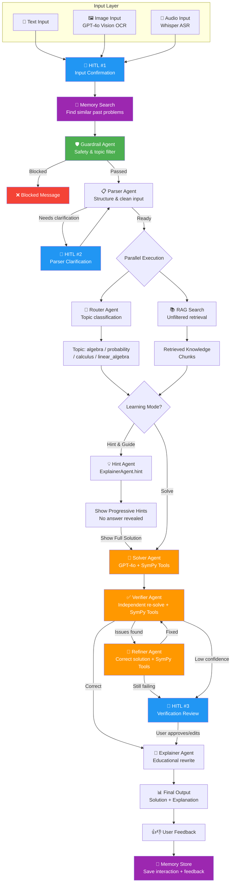

# 🧮 Math Mentor — JEE Advanced Problem Solver

An AI-powered math tutoring system with multi-agent reasoning, RAG, human-in-the-loop, and self-learning memory.


**🔗 Live Demo:** [link to be added after deployment]

**📹 Demo Video:** [link to be added]

---

## Features

- **Multimodal input** — text, image OCR (GPT-4o Vision), and audio transcription (Whisper)
- **7 specialized AI agents** — Guardrail, Parser, Router, Solver, Verifier, Refiner, Explainer
- **RAG pipeline** with 248 curated JEE math knowledge chunks across 18 documents
- **2 learning modes** — Solve (full solution) and Hint & Guide (progressive hints without answers)
- **Human-in-the-loop** at 3 checkpoints (input confirmation, parser clarification, verification review)
- **Memory system** that learns from feedback and retrieves similar past problems via semantic search
- **SymPy-powered tool calling** for verified mathematical computation (8 tools)
- **Agent trace visualization** showing full reasoning pipeline with timing data

---

## Architecture



> **Note:** Agents highlighted in orange (Solver, Verifier, Refiner) use SymPy tool calling for verified computation. Blue nodes are HITL checkpoints. Purple nodes are memory operations.

---

## Tech Stack

| Layer | Technology | Purpose |
|-------|-----------|---------|
| **Frontend** | Streamlit | Interactive web UI with session state |
| **LLM** | GPT-4o (OpenAI) | Reasoning, function calling, OCR, explanation |
| **Embeddings** | text-embedding-3-small | Knowledge base & memory vector embeddings |
| **Speech-to-Text** | Whisper (OpenAI) | Audio transcription with math-aware post-processing |
| **Vector Database** | ChromaDB | Knowledge retrieval + semantic memory search |
| **Math Engine** | SymPy | Symbolic computation (8 verified tools) |
| **Package Manager** | uv | Fast Python dependency management |
| **Language** | Python 3.12 | Type hints, modern syntax |

---

## Agents

| Agent | Role | Key Detail |
|-------|------|------------|
| **🛡️ Guardrail** | Filters unsafe or off-topic input | Returns `is_valid`, `reason`, `category` |
| **📋 Parser** | Cleans and structures raw input | Extracts variables, constraints, what-to-find; flags ambiguity |
| **🧭 Router** | Classifies topic and subtopic | algebra, probability, calculus, or linear_algebra |
| **🔢 Solver** | Solves the problem using GPT-4o + SymPy | Function calling with 8 math tools; returns steps + confidence |
| **✅ Verifier** | Independently re-solves and cross-checks | Uses its own SymPy calls; returns `is_correct` + `confidence` |
| **🔧 Refiner** | Corrects failed solutions | Takes verifier issues as input; up to 1 retry iteration |
| **📖 Explainer** | Rewrites solution for education / generates hints | `explain()` for full solutions, `hint()` for guided learning |

---

## Setup & Run

### Using uv (recommended)

```bash
# Clone
git clone <repo-url>
cd math-mentor

# Install dependencies (requires Python 3.12)
uv sync

# Set up environment
cp .env.example .env
# Edit .env and add your OpenAI API key

# Build the knowledge base (one-time, ~$0.01)
uv run python -m rag.embedder

# Run the app
uv run streamlit run app.py
```

### Using pip

```bash
# Clone
git clone <repo-url>
cd math-mentor

# Create virtual environment
python -m venv venv
source venv/bin/activate  # On Windows: venv\Scripts\activate

# Install dependencies
pip install -r requirements.txt

# Set up environment
cp .env.example .env
# Edit .env and add your OpenAI API key

# Build the knowledge base (one-time, ~$0.01)
python -m rag.embedder

# Run the app
streamlit run app.py
```

The app will open at `http://localhost:8501`.

---

## Project Structure

```
math-mentor/
├── agents/
│   ├── guardrail_agent.py    # Input safety & topic filter
│   ├── parser_agent.py       # OCR/ASR cleanup, structure extraction
│   ├── router_agent.py       # Topic classification
│   ├── solver_agent.py       # GPT-4o + SymPy function calling solver
│   ├── verifier_agent.py     # Independent solution verification
│   ├── refiner_agent.py      # Solution correction after verification failure
│   └── explainer_agent.py    # Educational rewrite + hint generation
├── data/
│   ├── knowledge/            # 18 curated JEE math documents (.md)
│   └── chroma_db/            # ChromaDB persistent vector store
├── demo/
│   ├── demo_questions.txt    # Pre-tested demo questions
│   └── README.md             # Demo video script
├── memory/
│   ├── store.py              # MemoryStore: JSON + ChromaDB hybrid
│   └── memory.json           # Persisted interaction history
├── rag/
│   ├── embedder.py           # Chunk & embed knowledge base
│   └── retriever.py          # Semantic search over knowledge chunks
├── tools/
│   └── sympy_tools.py        # 8 SymPy tools + run_tool() dispatcher
├── utils/
│   ├── ocr.py                # GPT-4o Vision image-to-text
│   ├── asr.py                # Whisper audio-to-text
│   └── trace.py              # AgentTracer for pipeline visualization
├── app.py                    # Streamlit UI (main entry point)
├── config.py                 # Central configuration
├── pyproject.toml            # Dependencies (uv)
├── requirements.txt          # Dependencies (pip)
├── EVALUATION.md             # Test results & evaluation report
└── .env.example              # Environment variable template
```

---

## How It Works

When a user submits a math problem, here's what happens:

1. **Input Processing** — Text is used directly; images go through GPT-4o Vision OCR; audio goes through Whisper with math-aware post-processing (e.g., "x squared" → `x**2`). A confidence badge shows extraction quality.

2. **HITL #1 — Input Confirmation** — The user reviews and can edit the extracted text before proceeding.

3. **Memory Search** — The system checks ChromaDB for semantically similar past problems (threshold: 0.85). If found, the previous solution is shown alongside the new one.

4. **Guardrail Check** — Screens for unsafe, off-topic, or non-math content. Blocks with a clear reason if rejected.

5. **Parsing** — The Parser agent cleans the input and extracts structure (variables, constraints, what to find). If ambiguous, it triggers **HITL #2** for clarification.

6. **Parallel Phase** — Router (topic classification) and RAG (knowledge retrieval) run concurrently via `ThreadPoolExecutor`.

7. **Solving** — In Solve mode, the Solver agent uses GPT-4o with function calling to delegate computation to SymPy tools. In Hint mode, the Explainer generates progressive hints without revealing the answer.

8. **Verification** — The Verifier independently re-solves the problem using its own SymPy calls and cross-checks against the Solver's answer. If issues are found, the Refiner attempts correction.

9. **HITL #3 — Verification Review** — Triggered when verifier confidence < 0.75 or refiner fails. The user can approve, edit, or reject the solution.

10. **Explanation** — The Explainer rewrites the verified solution in a student-friendly format with concept connections.

11. **Feedback & Memory** — The user rates the solution (correct/incorrect). The interaction is saved to memory for future retrieval and self-learning.

---

## Human-in-the-Loop Checkpoints

| Checkpoint | Trigger | What Happens |
|-----------|---------|--------------|
| **HITL #1** — Input Confirmation | Always (for image/audio input) | User reviews extracted text, edits if needed, then confirms |
| **HITL #2** — Parser Clarification | Parser flags `needs_clarification: true` | User answers clarification questions or rephrases the problem |
| **HITL #3** — Verification Review | Verifier confidence < 0.75 or refiner fails | User reviews the solution, can edit the answer, approve, or reject |

---

## Memory & Self-Learning

Math Mentor remembers past interactions and improves over time:

- **Semantic Search** — When a new problem arrives, ChromaDB finds similar past problems using embedding similarity (threshold: 0.85). If a match is found, the previous solution is displayed as a reference.
- **Feedback Loop** — User ratings (correct/incorrect) are persisted alongside the full interaction (problem, solution, topic, agent trace). Successful solutions are prioritized in future retrievals.
- **Hybrid Storage** — Interactions are stored in both a JSON file (`memory/memory.json`) for structured access and ChromaDB (`past_solutions` collection) for vector search.
- **Memory UI** — The sidebar shows memory stats (total interactions, correct/incorrect counts, topic breakdown) and provides a clear button for resetting.

---

## Evaluation

See [EVALUATION.md](EVALUATION.md) for the full test results across 10 JEE-level questions covering algebra, probability, calculus, and linear algebra.

---

## Acknowledgments

- **MALT Framework** — The Generator-Verifier-Refiner loop is inspired by the [MALT (Multi-Agent LLM Training)](https://arxiv.org/abs/2412.01928) architecture for multi-agent verification and refinement.
- **JEE Advanced** — Test questions and knowledge base content are based on the Joint Entrance Examination (Advanced) syllabus for mathematics.
- Built with [OpenAI GPT-4o](https://openai.com/gpt-4o), [Streamlit](https://streamlit.io/), [ChromaDB](https://www.trychroma.com/), and [SymPy](https://www.sympy.org/).
